# SCRAM BoxApp 中文用户操作手册

本手册面向第一次接触 SCRAM 的用户，也面向需要复现实验的专业用户。它介绍 Windows 安装、界面按钮、典型实验配置、运行结果读取，以及本软件围绕 **internal mixing** 与 **external mixing** 两种气溶胶混合假设所做的标准测试。

本手册不再使用手写章节编号，生成 PDF 时也不启用自动章节编号，因此不会再出现“1.4 后面又跟 4.”这类双重编号。

## 软件目的

SCRAM 的全称是 **Size-Composition-Resolved Aerosol Model**，意思是“按粒径和组成解析的气溶胶模型”。根据 SCRAM 官网和 Zhu、Sartelet、Seigneur (2015) 的 GMD 论文，SCRAM 的核心目标是模拟 **externally mixed particles** 的动力学演化，并与 **internally mixed simulations** 对比。

本软件的目标不是比较两种 RDB 或 nearest/legacy 方法。当前 GUI 的主线已经改为：

- **internal mixing**：同一粒径段内的颗粒被看作具有一个平均组成，计算快，但不能区分同粒径内不同组成颗粒。
- **external mixing**：同一粒径段内继续划分多个组成区间，可以分析颗粒是否已经混合、哪些粒径段中 mixed/unmixed 颗粒更多，计算量也更大。
- **标准实验目标**：对比 internal 与 external 假设对总质量、总数量、粒径分布、混合比例和运行时间的影响。

参考资料：

- SCRAM 官网：[https://cerea.enpc.fr/scram/index.html](https://cerea.enpc.fr/scram/index.html)
- GMD 论文：Zhu et al. (2015), “A size-composition resolved aerosol model for simulating the dynamics of externally mixed particles: SCRAM (v1.0)”, [https://doi.org/10.5194/gmd-8-1595-2015](https://doi.org/10.5194/gmd-8-1595-2015)

## 安装软件

安装包位于：

`dist/windows/SCRAMBoxApp-Setup-windows-x64.exe`

便携压缩包位于：

`dist/windows/SCRAMBoxApp-windows-x64.zip`

推荐普通用户使用安装包。

### 在当前电脑安装

1. 双击 `SCRAMBoxApp-Setup-windows-x64.exe`。
2. 如果 Windows 弹出安全提示，确认文件来源后选择继续运行。
3. 安装完成后，安装程序会询问是否立即启动软件。
4. 桌面和开始菜单会生成 `SCRAM BoxApp` 快捷方式。
5. 以后直接双击桌面图标即可打开 GUI。

### 在新电脑安装

1. 把 `SCRAMBoxApp-Setup-windows-x64.exe` 拷贝到新电脑。
2. 双击安装包。
3. 不需要额外安装 Linux、WSL、Python、Fortran 编译器或 NetCDF。
4. 安装位置默认在当前用户目录下：`%LOCALAPPDATA%\Programs\SCRAM BoxApp`。

### 正确的启动入口

请启动：

`SCRAM BoxApp.exe`

不要双击：

`ProgramSCRAM.exe`

`ProgramSCRAM.exe` 是 SCRAM 科学计算核心，只能接受配置文件参数。它不是图形界面入口，直接双击时可能像“闪退”一样马上关闭，这是命令行程序的正常表现。

### 卸载

可以在 Windows “设置 > 应用”中卸载 `SCRAM BoxApp`，也可以进入安装目录运行 `Uninstall SCRAM BoxApp.cmd`。

## 界面总览

软件顶部是工具栏，下面是多个工作页签。常用流程是：实验设置、结构编辑、运行监控、结果分析、报告导出。

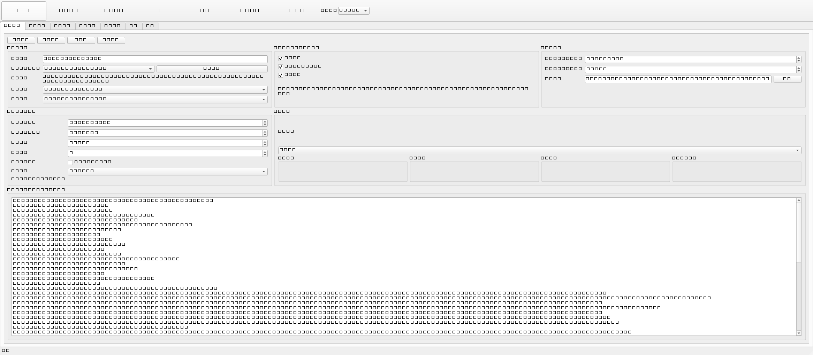

### 顶部工具栏

- **新建实验**：恢复到默认实验模板。
- **载入实验**：载入已有 `.cfg` 配置文件。
- **保存实验**：把当前界面中的设置写回配置文件。
- **运行**：运行当前页中选定的一个混合假设。
- **停止**：尝试停止正在运行的 SCRAM 核心程序。
- **查看结果**：跳转到结果分析页。
- **导出报告**：跳转到报告导出页。
- **界面语言**：在 `zh_CN` 和 `en_US` 之间切换。

## 实验设置页

实验设置页用于选择模板、物理过程、混合假设、环境条件和输出目录。


### 实验与方案

- **实验名称**：本次实验的名称。建议使用不含空格的英文名，例如 `gmd_paris_full`。
- **模板 / 预设**：选择内置实验模板。论文相关模板包括 GMD hazy 验证案例和 GMD 巴黎场景 A/B/C/D。
- **载入模板**：把所选模板写入界面。
- **模板说明**：解释该模板对应的论文场景。
- **案例预设**：决定物理过程组合和推荐模拟时长。场景 D 应选择 `gmd_paris_full`。
- **混合假设**：选择 `INTERNAL_MIXING` 或 `EXTERNAL_MIXING`。

### 过程开关与混合假设说明

- **启用凝并**：颗粒之间碰撞合并，英文常写作 coagulation。
- **启用冷凝 / 蒸发**：气态物质转入颗粒相或颗粒相物质回到气相，英文常写作 condensation/evaporation。
- **启用成核**：从气态前体生成新的超细颗粒，英文是 nucleation。
- **external mixing 说明文字**：提醒用户 external mixing 会在粒径和组成网格上解析颗粒。

### 运行与输出

- **模拟时长（小时）**：总模拟时间。论文 Greater Paris 案例使用 12 小时。
- **最小时间步（秒）**：积分器允许使用的最小时间步。
- **输出目录**：运行结果、CSV、日志和图像保存位置。

### 环境与初始状态

- **温度 (K)**：绝对温度。K 是开尔文，0 摄氏度约等于 273.15 K。
- **压力 (Pa)**：帕斯卡。101325 Pa 约等于 1 个标准大气压。
- **相对湿度**：0 到 1 之间的小数，例如 0.746 表示 74.6%。
- **初始场景**：对应 SCRAM 配置中的初始条件编号。
- **初始混合状态**：如果勾选，初始颗粒按外混状态放置；论文 Greater Paris 对比通常先假设初始浓度为内部混合，再让 external 网格解析后续演化。
- **密度模式**：使用真实密度或固定密度。

## 结构编辑页

结构编辑页用于查看和调整 species、粒径段、质量分数段、排放矩阵和初始质量矩阵。

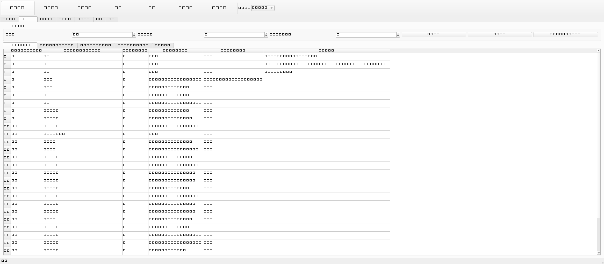

### 维度与结构生成

- **组分数**：参与计算的物种数量。当前演示包 Greater Paris 模板使用 30 个颗粒物种。
- **粒径分段数**：size bins 数量。Greater Paris 参考场景使用 7 个粒径段。
- **质量分数分段数**：external mixing 中每个组成组的质量分数区间数量。论文 Paris 案例使用 3 段：`0-0.2`、`0.2-0.8`、`0.8-1.0`。
- **生成结构**：根据上面的维度重建所有表格。
- **重建表格**：重新刷新表格显示。
- **自动生成对数粒径边界**：按对数间隔生成粒径段边界。

### Species 表

- **species_id**：物种编号。
- **species_name**：物种名称。
- **group_id**：物种所属组成组。论文 Paris 案例把物种分为 hydrophilic inorganic、hydrophilic organic、hydrophobic organic、black carbon、dust 五类。
- **init_gas**：气相初始浓度。
- **emission**：排放量。
- **notes**：备注。

### Size bins 表

粒径段描述颗粒直径范围。论文 Greater Paris 案例使用的粒径边界是：

`0.001, 0.005, 0.01, 0.0398, 0.1585, 0.6310, 2.5119, 10` 微米。

每一段代表一个直径范围，例如 `0.0398-0.1585 µm`。

### Fraction 表

fraction 是质量分数区间，用于 external mixing。举例：

- `0-0.2`：某一组成组占比很低。
- `0.2-0.8`：该组成组和其他组有明显混合。
- `0.8-1.0`：该组成组占比很高，接近单一组成。

### Emission 表

Emission 表是排放矩阵。行通常对应 species，列对应粒径段。数值越大表示该 species 在该粒径段的排放越强。

### 初始质量表

初始质量表定义模拟开始时每个 species 在各个粒径段中的质量。它决定 0 小时的气溶胶状态。

## 运行监控页

运行监控页显示当前运行状态，也提供两个主要运行按钮。

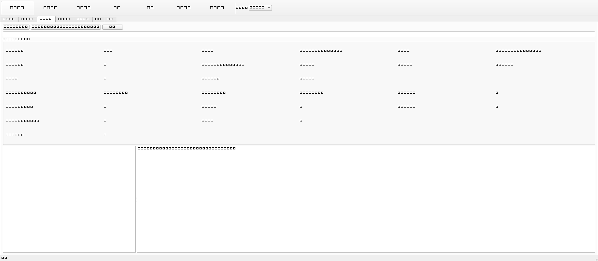

### 运行按钮

- **运行当前混合假设**：只运行实验设置页中选定的 `INTERNAL_MIXING` 或 `EXTERNAL_MIXING`。
- **比较 internal / external**：连续运行 internal 和 external 两组实验，并自动写入对比 CSV。
- **停止**：停止当前运行。

### 运行指标

- **status**：当前状态，例如 pending、running、finished。
- **current_case**：当前案例名，例如 `gmd_paris_full`。
- **current_scheme**：当前运行的混合假设。
- **wall-clock**：真实耗时。
- **simulated hours**：已经推进的模拟小时数。
- **total number**：颗粒数浓度总量。
- **total mass**：颗粒质量浓度总量。
- **active bins / active pairs**：当前活跃粒径段和凝并配对数量。
- **log**：SCRAM 核心运行日志。

external mixing 的状态变量更多，所以通常比 internal mixing 慢。这个现象和论文中关于计算成本的讨论一致。

## 结果分析页

结果分析页显示图像、CSV 和日志。点击左侧文件名即可预览。

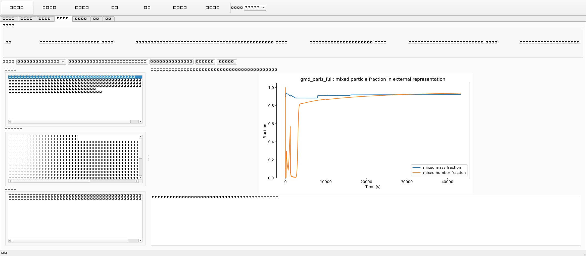

### 结果摘要

摘要栏显示：

- **方案**：当前是否有 internal/external 对比。
- **运行时间**：两种假设分别用了多少秒。
- **终态质量**：12 小时结束时的总质量。
- **终态数量**：12 小时结束时的总颗粒数。
- **相对差值**：internal 相对 external 的差值。

本次标准测试的 Greater Paris 场景 D 结果为：

| 混合假设 | 终态质量 | 终态数量 | 运行时间 | 步数 |
| --- | ---: | ---: | ---: | ---: |
| INTERNAL_MIXING | 32.7327 | 1.0240e10 | 1.66 s | 88 |
| EXTERNAL_MIXING | 33.8691 | 1.1436e10 | 22.88 s | 382 |

internal 相对 external 的终态质量差约为 `-3.36%`，终态数量差约为 `-10.46%`。这说明两种假设的总量级一致，但 external mixing 在组成和混合状态层面提供了更多信息。

## 报告导出页

报告页用于选择要放入报告的图片并生成 PDF。

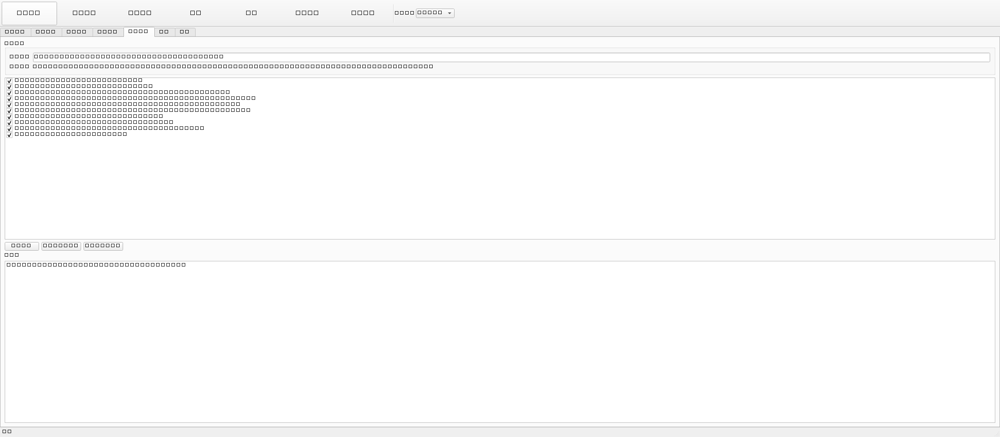

### 操作步骤

1. 先完成一次运行或一次 internal/external 对比。
2. 打开“报告导出”页。
3. 勾选需要放入报告的图。
4. 点击“生成报告”。
5. 生成后可以点击“打开 .tex”或“打开 .pdf”。

生成的报告文件名是：

`internal_external_mixing_report.pdf`

### 报告生成依赖

普通用户不需要单独安装 LaTeX。软件内置了离线 PDF 后端：如果新电脑上没有 `xelatex` 或 `tectonic`，点击“生成报告”时仍会直接生成 PDF。

如果用户需要编辑 `.tex` 源文件，或希望使用 LaTeX 后端重新排版，可以安装可选依赖包：

- 安装包位置：`dist/windows/dependencies/basic-miktex-25.12-x64.exe`
- 说明文件：`dist/windows/dependencies/README_REPORT_DEPENDENCIES_zh.md`
- 校验值 SHA-256：`14B42DD9F4B4A7813A8BFD69C8F99316C2888CC4EE26F631F397E163D85D6C62`

安装步骤：

1. 关闭 `SCRAM BoxApp`。
2. 双击 `basic-miktex-25.12-x64.exe`。
3. 使用默认安装方式即可；如果提示安装缺失宏包，选择允许。
4. 安装完成后重新打开 `SCRAM BoxApp`。
5. 回到“报告导出”页，重新点击“生成报告”。

如果 LaTeX 编译失败，软件会自动退回到内置离线 PDF 后端，并在报告页日志中写明失败原因和修复方法。

## 设置页和帮助页

设置页用于修改默认输出目录和界面模式。

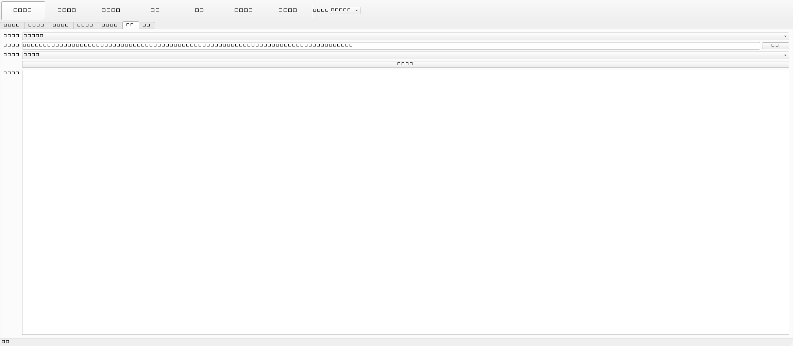

帮助页提供内置说明，可在没有本手册时快速查阅。

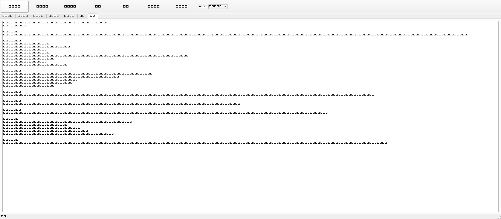

## 典型实验：Greater Paris 场景 D

本节是推荐的标准实验。它对应 Zhu et al. (2015) 论文第 4 节中的 Greater Paris 场景 D：排放、凝并、冷凝/蒸发和成核全部启用。

### 论文中的实验背景

论文 Greater Paris 案例使用巴黎地区实际浓度和排放资料，模拟 2009 年 7 月的气溶胶演化。粒径范围约为 `0.001-10 µm`，划分为 7 个粒径段。组成被分为 5 个组：

- **HLI**：hydrophilic inorganic，亲水无机物。
- **HLO**：hydrophilic organic，亲水有机物。
- **HBO**：hydrophobic organic，疏水有机物。
- **BC**：black carbon，黑碳。
- **DU**：dust，沙尘。

论文把前四个组成组分别按质量分数切成 3 段，dust 由守恒关系确定，因此形成一组可能的 composition sections。论文 Table 2 显示，混合颗粒比例会随物理过程变化而变化：只考虑排放、加入凝并、加入冷凝/蒸发、加入完整动力学时，mixed number 和 mixed mass 的比例都会不同。

### 在软件中设置

1. 打开 `SCRAM BoxApp`。
2. 在“实验设置”页中选择模板：`GMD 巴黎场景 D（全过程）`。
3. 点击“载入模板”。
4. 确认“案例预设”为 `gmd_paris_full`。
5. 确认三个过程都勾选：凝并、冷凝/蒸发、成核。
6. 确认“模拟时长（小时）”为 `12`。
7. 确认“混合假设”为 `EXTERNAL_MIXING`。
8. 进入“运行监控”页。
9. 点击“比较 internal / external”。

### 运行结束后应看到的文件

输出目录中会出现：

- `final_state_summary.csv`：两种混合假设的终态质量和数量。
- `performance_summary.csv`：运行时间、步数、日志路径。
- `runs/gmd_paris_full/internal_mixing/`：internal mixing 详细输出。
- `runs/gmd_paris_full/external_mixing/`：external mixing 详细输出。
- `figures/`：自动生成的结果图。

### 正确结果图：总质量

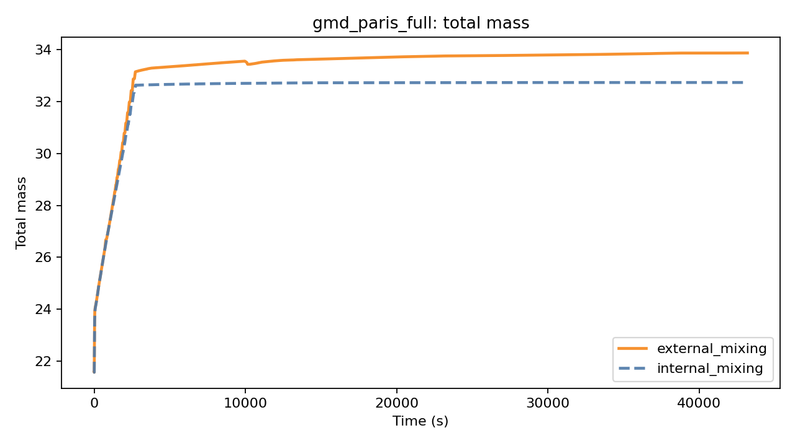

图中横轴是时间，单位为秒；纵轴是总质量。internal 和 external 的总质量在同一量级，说明两种假设下宏观质量演化相近。终态 external 略高，本次标准运行约为 `33.8691`，internal 约为 `32.7327`。

### 正确结果图：总数量

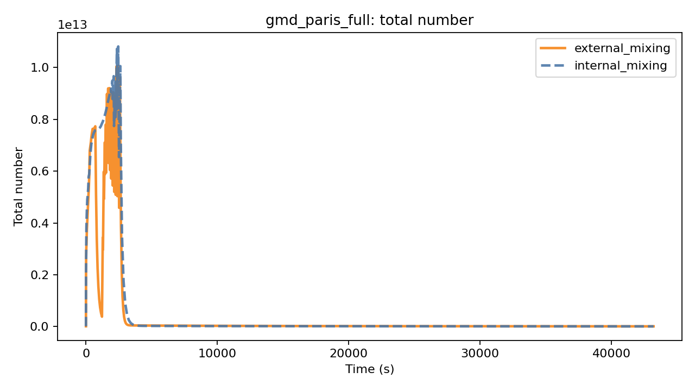

总数量代表颗粒数浓度。external mixing 的终态数量约为 `1.1436e10`，internal mixing 约为 `1.0240e10`。数量差异比质量差异更明显，说明混合状态假设对数浓度演化更敏感。

### 正确结果图：相对 external 的质量差

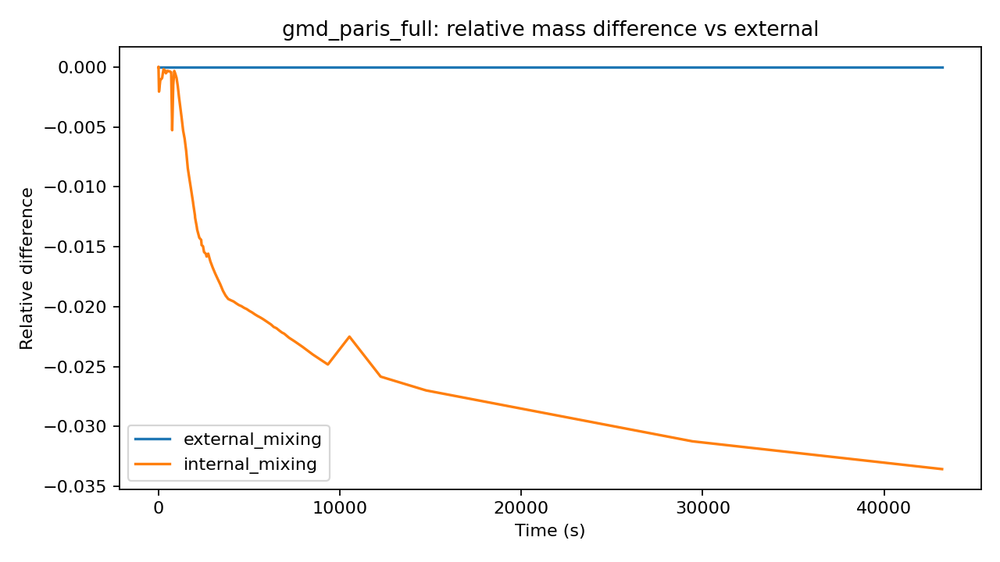

这张图以 external mixing 为参考，显示 internal mixing 与它的相对质量差。接近 0 表示两者几乎一致；偏离 0 表示混合假设影响了结果。

### 正确结果图：相对 external 的数量差

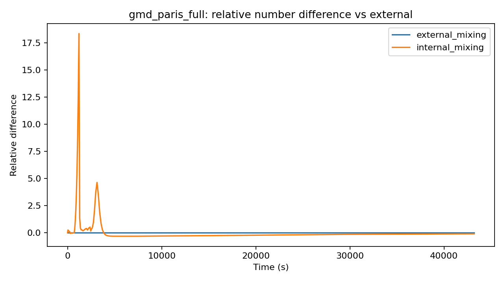

数量差曲线用于判断 internal/external 对颗粒数浓度的影响。本次运行中，终态 internal 数量低于 external，最终相对差约为 `-10.46%`。

### 正确结果图：external mixed fraction


这是 external mixing 才能给出的关键图。它显示混合颗粒在总质量和总数量中的比例：

- **mixed mass fraction**：混合颗粒贡献的质量比例。
- **mixed number fraction**：混合颗粒贡献的数量比例。

如果曲线上升，说明更多颗粒从 unmixed 状态转为 mixed 状态。凝并和冷凝/蒸发都会推动颗粒组成发生混合。

### 正确结果图：不同粒径段的 mixed/unmixed 质量

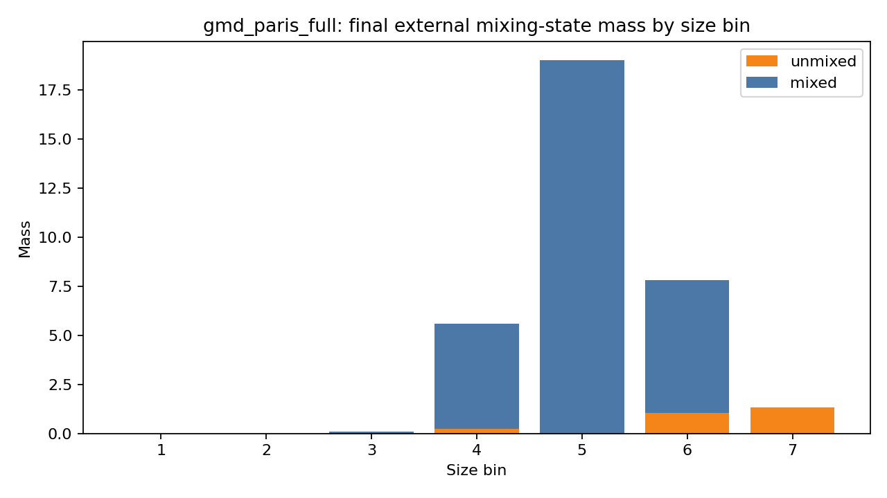

这张图把终态质量按粒径段拆分，并区分 mixed 与 unmixed。它回答的问题是：哪些粒径段的颗粒更容易处于混合状态。

### 正确结果图：终态质量和数量柱状对比

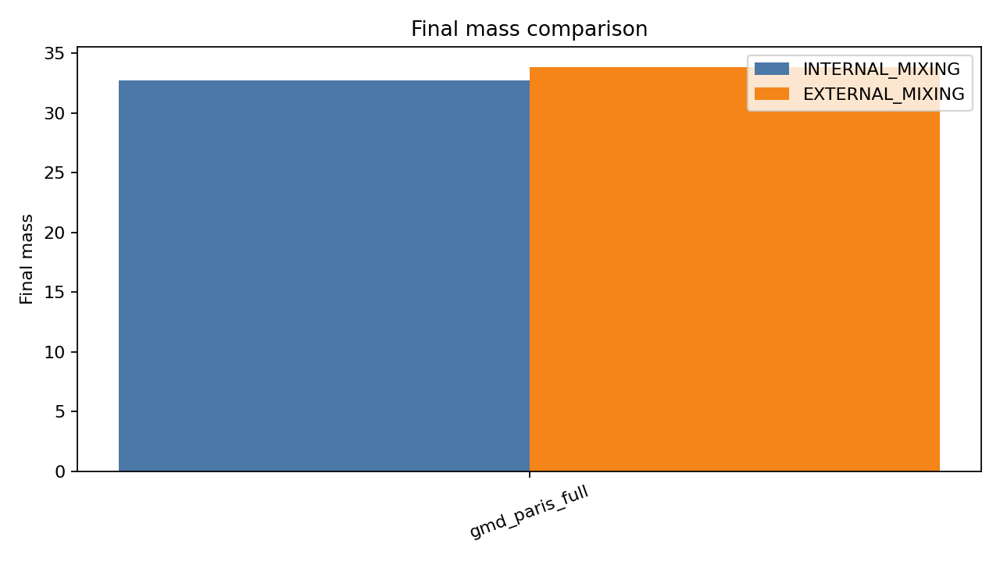

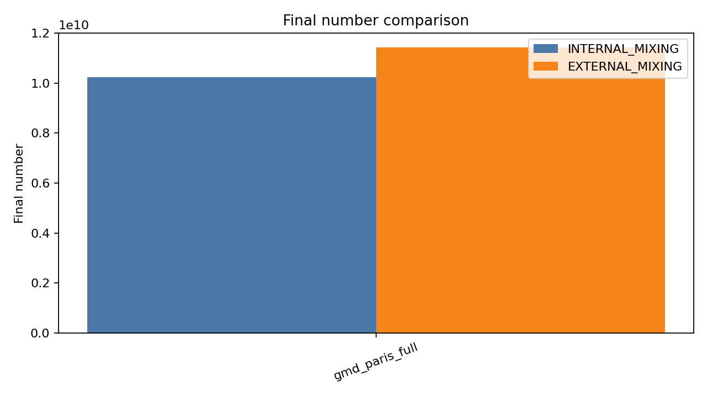

柱状图适合快速检查两组实验是否都成功运行，以及终态值是否和摘要 CSV 一致。

### 正确结果图：运行时间对比

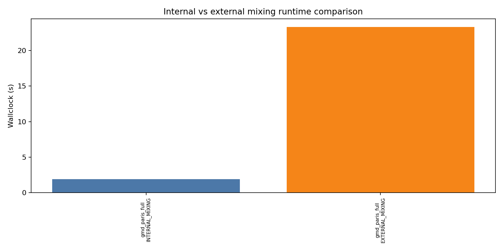

external mixing 运行更慢，因为它跟踪更多组成状态。本次标准运行中，external mixing 约 `22.88 s`，internal mixing 约 `1.66 s`。

### 正确结果图：混合假设示意

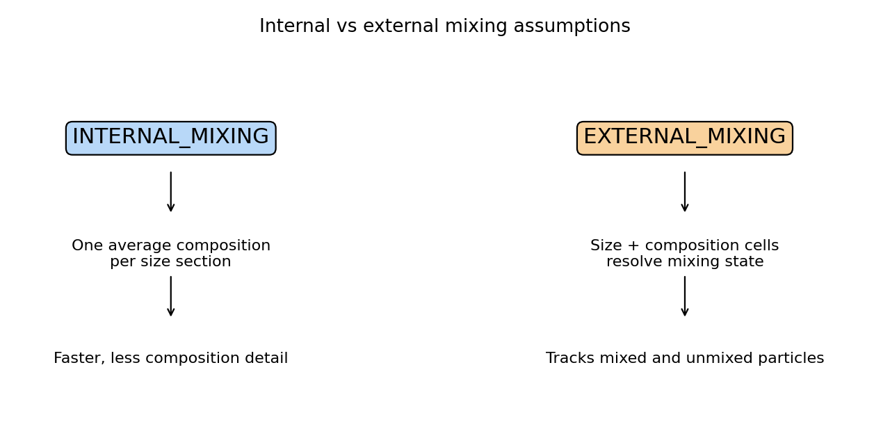

这张图用于理解两种假设的区别：internal mixing 把同一粒径段平均化；external mixing 保留不同组成格点。

## 如何解读结果

### 先看运行是否成功

打开 `performance_summary.csv`，确认两行的 `status` 都是 `ok`。如果不是 `ok`，先打开对应 `run.log` 查找错误。

### 再看总量

总质量和总数量用于判断宏观结果是否合理。internal/external 不要求完全相同，因为两者的状态空间和混合假设不同，但通常应该在同一数量级。

### 然后看 mixed fraction

mixed fraction 是本软件最重要的 external mixing 结果。它告诉你：

- 颗粒群是否越来越混合。
- 质量混合比例和数量混合比例是否一致。
- 凝并、冷凝/蒸发、成核是否改变了混合状态。

### 最后看粒径段

粒径段 mixed/unmixed 图用于解释混合发生在哪些粒径范围。小粒径颗粒数量多，大粒径颗粒质量贡献大，因此 number fraction 和 mass fraction 可能呈现不同趋势。

## 常见问题

### 双击 ProgramSCRAM.exe 闪退

这是正常的。`ProgramSCRAM.exe` 是命令行核心，不是 GUI。请从桌面快捷方式或开始菜单打开 `SCRAM BoxApp`。

### 找不到结果图

先确认运行结束后 `status` 是 `ok`。然后点击“查看结果”，选择当前案例 `gmd_paris_full`。如果仍没有图，点击“刷新 internal vs external 摘要”。

### 运行很慢

external mixing 比 internal mixing 慢很多，这是模型特性，不是软件卡死。可以先用教学案例或较短模拟时长确认流程，再运行 12 小时正式案例。

### PDF 报告打不开

先确认“报告导出”页已经点击“生成报告”。如果系统没有默认 PDF 阅读器，可以在输出目录中找到 PDF 文件后用浏览器打开。

如果点击“生成报告”后看到 LaTeX 相关错误，不影响普通 PDF 生成：软件会使用内置离线 PDF 后端。若确实需要 LaTeX 后端，请运行 `dist/windows/dependencies/basic-miktex-25.12-x64.exe` 安装 MiKTeX，重启软件后再试。

### 结果和论文数值不完全一致

论文结果来自完整科研设置和原始输入资料。本 Windows GUI 包保留了论文案例的核心过程组合、粒径分段和 internal/external 假设对比，但演示包中的 species 输入和运行封装经过了桌面软件化整理。手册中的图片和表格来自本机真实标准测试，主要用于验证软件安装、运行和结果解读流程。

## 标准测试记录

本手册使用以下命令重新生成结果图和报告：

```powershell
core\executables_or_wrappers\runtime\windows\.venv\Scripts\python.exe scripts\run_standard_tests.py --template gmd_paris_full --case gmd_paris_full --output-root install_logs\mixing_report_tests
```

测试通过项目：

- Python/PySide6 导入检查通过。
- GUI 构建检查通过。
- `ProgramSCRAM.exe` Windows 核心真实运行通过。
- internal/external comparison 两组运行均 `ok`。
- 结果图全部生成。
- 内置 PDF 报告生成通过。
