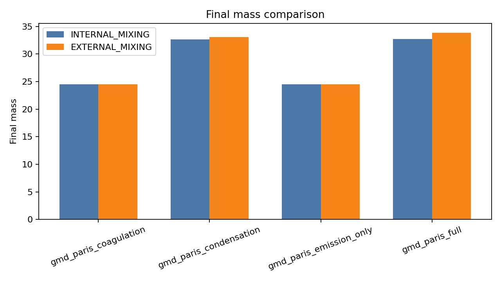
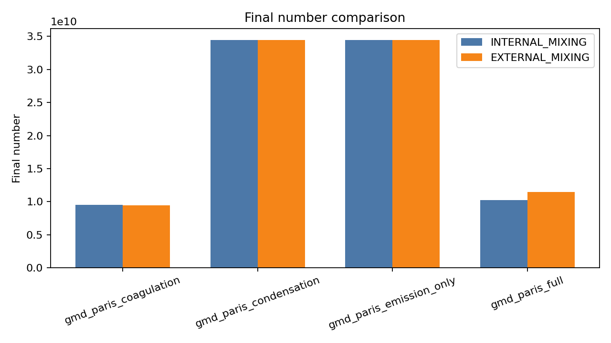
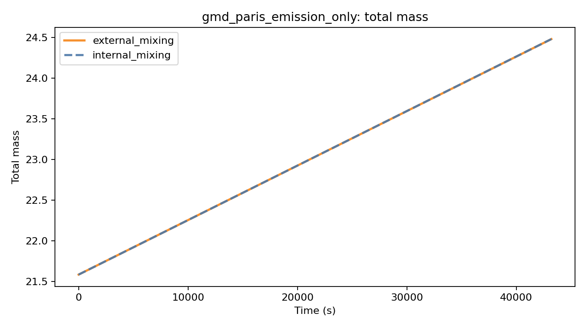
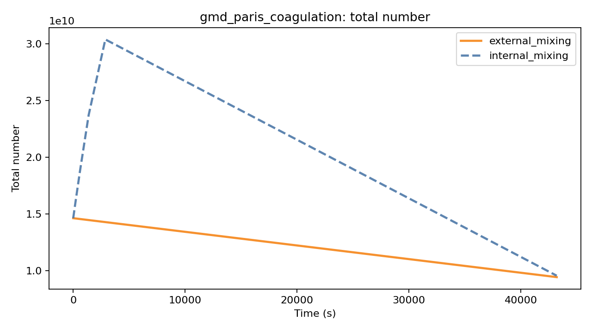
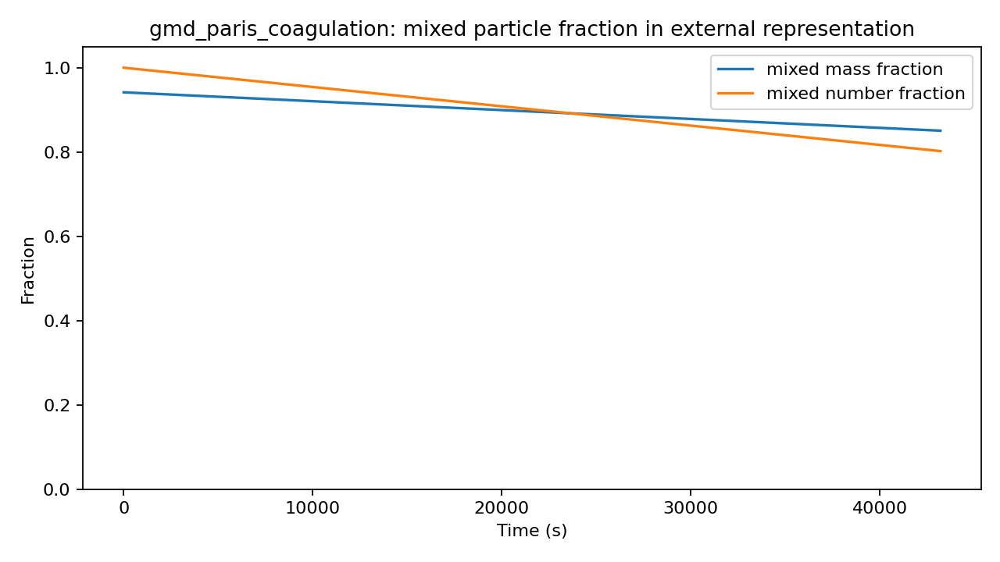
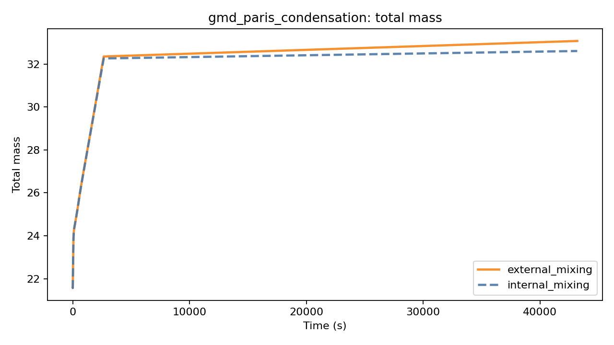
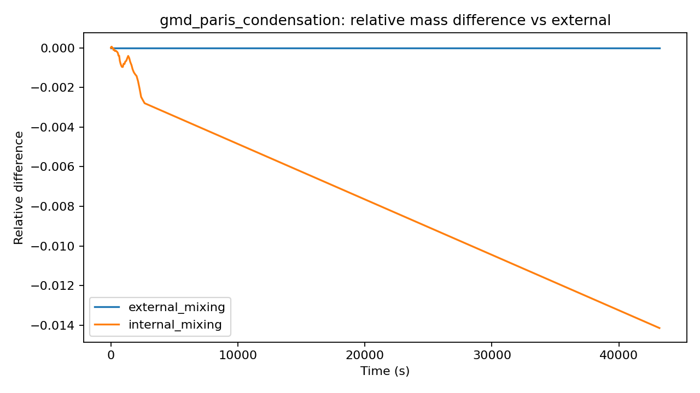
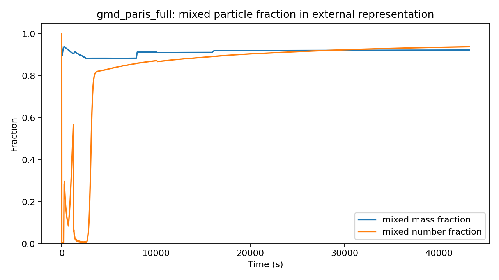

# SCRAM BoxApp 本科教学实验手册

适用对象：大气科学、环境科学、环境工程、应用化学、地球系统科学等专业本科生。

建议学时：6 次实验课，每次 2 学时；或 3 次综合实验课，每次 4 学时。

软件目标：用 SCRAM BoxApp 观察和解释气溶胶颗粒在 **internal mixing** 与 **external mixing** 两种混合态假设下的微物理演化差异。

## 学习目标

完成本实验后，学生应能：

- 解释 internal mixing 与 external mixing 的物理含义。
- 说清楚凝并、冷凝/蒸发、成核对颗粒数浓度、质量浓度、粒径分布和混合态的影响。
- 使用 SCRAM BoxApp 设置模板、运行实验、查看 CSV、图像和报告。
- 用 `final_state_summary.csv`、`performance_summary.csv` 和图像结果判断不同过程的主导作用。
- 理解 external mixing 为什么通常更慢，以及它为什么能提供 mixed / unmixed 信息。
- 根据实验结果写出简短科学解释，而不是只照抄图表。

## 核心概念速查

**气溶胶颗粒**：悬浮在空气中的液体或固体微小颗粒，例如硫酸盐、黑碳、有机物、尘土等。

**粒径分布**：不同大小颗粒的数量或质量分布。小颗粒通常数量多，大颗粒通常贡献更多质量。

**internal mixing**：同一个粒径段内的颗粒被看作具有相同平均组成。它计算较快，但不能区分同一粒径内不同颗粒的组成差异。

**external mixing**：同一粒径段内继续区分不同组成区间。它可以判断颗粒是否 mixed 或 unmixed，但状态变量更多，计算更慢。

**凝并 coagulation**：两个颗粒碰撞并合成一个更大的颗粒。通常会减少颗粒数浓度，增加平均粒径，但总质量近似守恒。

**冷凝/蒸发 condensation/evaporation**：气相物质进入颗粒相，或颗粒相物质回到气相。通常直接影响颗粒质量和组成。

**成核 nucleation**：气态前体形成新的超细颗粒。通常会增加小粒径颗粒数量。

**mixed fraction**：external mixing 输出的重要指标，表示已经混合的颗粒在总质量或总数量中的比例。

## 软件界面入口

学生启动软件后，主要使用三个页面：

- “实验设置”：选择模板、混合假设、过程开关和输出目录。
- “运行监控”：开始运行并观察实时状态。
- “结果分析”：查看图、CSV 和日志。


## 教学安排建议

| 周次 | 实验主题 | 主要问题 | 课堂产出 |
| --- | --- | --- | --- |
| 第 1 次 | 软件入门与基准运行 | 软件如何设置、运行、保存结果？ | 完成场景 D 的一次 internal/external 对比 |
| 第 2 次 | 混合态表示 | internal 与 external 在无复杂微物理时是否相同？ | 场景 A 结果表和解释 |
| 第 3 次 | 凝并过程 | 凝并为什么会减少颗粒数？是否改变总质量？ | 场景 B 质量、数量、mixed fraction 图 |
| 第 4 次 | 冷凝/蒸发过程 | 冷凝为什么主要改变质量和组成？ | 场景 C 质量差异分析 |
| 第 5 次 | 多过程耦合 | 凝并、冷凝和成核叠加后会发生什么？ | 场景 D 综合解释 |
| 第 6 次 | 灵敏度与开放课题 | 分辨率、湿度、初始混合态会怎样影响结果？ | 小组汇报和实验报告 |

建议 2 到 3 人一组。每组保留自己的输出目录，避免覆盖其他小组结果。

## 标准参考结果

下表由本机标准测试生成。不同电脑运行时间会略有变化，终态数值通常应接近。

| 场景 | 过程组合 | 混合假设 | 终态质量 | 终态数量 | 相对 external 质量差 | 相对 external 数量差 |
| --- | --- | --- | ---: | ---: | ---: | ---: |
| A | 排放 only | INTERNAL | 24.4820 | 3.4465e10 | 0.00% | 0.00% |
| A | 排放 only | EXTERNAL | 24.4820 | 3.4465e10 | 0.00% | 0.00% |
| B | 排放 + 凝并 | INTERNAL | 24.4820 | 9.5575e9 | 0.00% | +1.32% |
| B | 排放 + 凝并 | EXTERNAL | 24.4820 | 9.4329e9 | 0.00% | 0.00% |
| C | 排放 + 冷凝/蒸发 | INTERNAL | 32.6126 | 3.4465e10 | -1.41% | 0.00% |
| C | 排放 + 冷凝/蒸发 | EXTERNAL | 33.0803 | 3.4465e10 | 0.00% | 0.00% |
| D | 排放 + 凝并 + 冷凝/蒸发 + 成核 | INTERNAL | 32.7327 | 1.0240e10 | -3.36% | -10.46% |
| D | 全过程 | EXTERNAL | 33.8691 | 1.1436e10 | 0.00% | 0.00% |





## 实验一：软件入门与标准基准运行

### 实验目的

熟悉 SCRAM BoxApp 的基本操作，完成一次可重复的 internal/external mixing 标准对比。

### 背景

Greater Paris 场景 D 同时启用排放、凝并、冷凝/蒸发和成核，适合作为综合基准实验。它不是为了复现论文中每一个原始数值，而是用相同过程组合帮助学生理解混合态假设对结果的影响。

### 软件设置

- 模板：`GMD Greater Paris scenario D (full dynamics)`
- 案例预设：`gmd_paris_full`
- 过程开关：凝并、冷凝/蒸发、成核全部启用
- 模拟时长：`12 h`
- 输出目录：建议使用小组专属目录，例如 `D:\scram_student\group01\lab01`

### 操作步骤

1. 打开 SCRAM BoxApp。
2. 在“实验设置”页选择场景 D 模板。
3. 点击“载入模板”。
4. 打开“运行监控”页。
5. 点击“比较 internal / external”。
6. 等待两组运行结束，确认状态为 `ok`。
7. 打开“结果分析”页，查看总质量、总数量、相对差异和 mixed fraction 图。

### 应观察到的现象

- external mixing 通常比 internal mixing 慢。
- 两者总质量处于同一数量级，但不完全相同。
- external mixing 能输出 mixed fraction 和 mixed/unmixed by size 图。


### 思考题

- 为什么 external mixing 需要更多运行时间？
- 如果只看总质量，是否足以说明混合态差异？为什么？
- mixed fraction 图比总质量曲线多提供了什么信息？

## 实验二：混合态表示与场景 A

### 实验目的

理解在简单排放场景下，internal 与 external 可能给出相同宏观总量，但含义并不完全相同。

### 软件设置

- 模板：`GMD Greater Paris scenario A (emission only)`
- 案例预设：`gmd_paris_emission_only`
- 过程开关：凝并关、冷凝/蒸发关、成核关
- 运行方式：点击“比较 internal / external”

### 应观察到的现象

参考结果中，场景 A 的 internal 与 external 终态总质量和总数量相同。这说明在没有凝并、冷凝和成核时，两种表示的宏观总量可能一致。



### 分析提示

宏观总量相同不代表混合态信息相同。external representation 仍然保留组成网格，因此后续如果加入微物理过程，它会影响颗粒如何进入 mixed 或 unmixed 状态。

### 思考题

- 为什么场景 A 中两种假设给出的总质量和总数量相同？
- 如果下一步加入凝并，为什么 external mixing 可能开始表现出不同？
- 这一实验能否证明 internal mixing 永远足够？为什么不能？

## 实验三：凝并过程与颗粒数减少

### 实验目的

观察凝并对颗粒数浓度、平均粒径和混合态的影响。

### 背景

凝并会让两个颗粒合并成一个颗粒。这个过程近似守恒质量，但会减少颗粒数量。对于 external mixing，来自不同组成区间的颗粒发生凝并后，可能形成更混合的颗粒。

### 软件设置

- 模板：`GMD Greater Paris scenario B (emission + coagulation)`
- 案例预设：`gmd_paris_coagulation`
- 过程开关：凝并开、冷凝/蒸发关、成核关

### 应观察到的现象

- 总质量基本不变。
- 总数量明显低于场景 A。
- internal 与 external 的终态数量有小差异。
- external mixed fraction 可以显示凝并对混合状态的推动作用。





### 数据记录表

| 项目 | INTERNAL_MIXING | EXTERNAL_MIXING |
| --- | ---: | ---: |
| 终态质量 | | |
| 终态数量 | | |
| 运行时间 | | |
| 终态 mixed mass fraction | 不适用 | |
| 终态 mixed number fraction | 不适用 | |

### 思考题

- 凝并为什么会减少总数量，但不明显改变总质量？
- external mixed fraction 上升说明了什么？
- 如果初始颗粒完全 unmixed，凝并会怎样改变混合状态？

## 实验四：冷凝/蒸发与质量增长

### 实验目的

观察冷凝/蒸发对总质量和组成状态的影响，区分“数量变化”和“质量变化”的不同物理来源。

### 背景

冷凝把气相物质转移到颗粒相，通常会增加颗粒质量；蒸发则相反。冷凝/蒸发不一定直接改变颗粒数量，但会改变颗粒组成和粒径。

### 软件设置

- 模板：`GMD Greater Paris scenario C (emission + condensation)`
- 案例预设：`gmd_paris_condensation`
- 过程开关：凝并关、冷凝/蒸发开、成核关

### 应观察到的现象

参考结果中，internal 与 external 的终态数量几乎相同，但 external 的终态质量略高。这说明冷凝/蒸发过程主要影响质量和组成，而不是直接改变颗粒数。





### 思考题

- 为什么冷凝/蒸发对总质量更敏感？
- 为什么场景 C 的数量差异很小？
- external mixing 在冷凝/蒸发实验中能提供哪些 internal mixing 看不到的信息？

## 实验五：全过程耦合与场景 D

### 实验目的

综合分析排放、凝并、冷凝/蒸发和成核共同作用时，混合态假设如何影响宏观总量和微观组成状态。

### 软件设置

- 模板：`GMD Greater Paris scenario D (full dynamics)`
- 案例预设：`gmd_paris_full`
- 过程开关：凝并、冷凝/蒸发、成核全部开启

### 应观察到的现象

场景 D 中，internal 相对 external 的终态质量约低 `3.36%`，终态数量约低 `10.46%`。数量差异比质量差异更明显，说明混合态假设对颗粒数演化和粒径分布可能更敏感。




### 分析提示

先看总质量和总数量，再看 mixed fraction，最后看不同粒径段的 mixed/unmixed 质量。不要只用一张图下结论。

### 思考题

- 哪一个指标对混合态假设最敏感：总质量、总数量、mixed fraction，还是运行时间？
- 为什么全过程耦合下 internal/external 差异会比单过程更明显？
- 如果研究空气质量健康影响，为什么颗粒数浓度也很重要？

## 实验六：分辨率和初始混合态灵敏度

### 实验目的

理解模型分辨率和初始状态设置对结果和计算成本的影响。

### 可选任务

任务 A：改变 `n_frac`。

- 在“结构编辑”页把质量分数分段从 3 段改为 2 段或 4 段。
- 运行 external mixing。
- 比较 mixed fraction 和运行时间。

任务 B：改变初始混合状态。

- 在“实验设置”页勾选或取消“初始颗粒按外混放置”。
- 运行场景 D。
- 比较 external mixed fraction 的初始值和终态值。

任务 C：改变相对湿度。

- 在“实验设置”页把相对湿度从默认值改为 `0.4` 和 `0.8`。
- 运行场景 C 或 D。
- 比较总质量变化。

### 注意

灵敏度实验不要求所有小组得到相同结论。关键是说明你改变了什么、为什么改变、结果如何变化、这种变化是否符合微物理直觉。

### 思考题

- 分辨率越高一定越好吗？计算成本如何变化？
- 初始混合态是否会影响终态？什么时候影响更大？
- 湿度为什么可能影响冷凝/蒸发过程？

## 开放课题

每组从下面选择一个题目，或自拟题目经教师同意后完成。

### 题目一：哪一个过程最能改变混合状态？

比较场景 A/B/C/D 的 mixed mass fraction 和 mixed number fraction，判断排放、凝并、冷凝/蒸发、成核中哪一类过程对 mixed fraction 的影响最大。

### 题目二：混合态假设对计算成本的影响

统计四个场景中 internal 与 external 的 wall-clock 时间，画出运行时间比值，解释为什么状态变量越多计算越慢。

### 题目三：总质量和总数量哪一个更敏感？

对比四个场景的 `relative_difference_vs_external_mass` 和 `relative_difference_vs_external_number`，判断质量或数量哪个对混合态假设更敏感。

### 题目四：不同粒径段的混合状态

使用 `external_mixing_mass_by_size` 图，解释小粒径和大粒径段的 mixed/unmixed 质量差异。

## 实验报告要求

每组提交一份 PDF 或 Word 报告，建议结构如下：

- 实验标题和小组成员。
- 研究问题：一句话说明你想回答什么。
- 实验设置：模板、过程开关、混合假设、关键参数。
- 结果：至少 2 张图、1 张表。
- 解释：用微物理过程解释图表，不只描述“升高/降低”。
- 不确定性：说明可能的误差来源，例如运行时间波动、参数改动、分辨率选择。
- 结论：3 到 5 条要点。

## 评分建议

| 项目 | 分值 | 评价标准 |
| --- | ---: | --- |
| 软件操作 | 20 | 能独立设置模板、运行对比、找到输出文件 |
| 数据整理 | 20 | 表格清晰，能正确读取 CSV 和图像 |
| 微物理解释 | 30 | 能把凝并、冷凝/蒸发、成核与结果联系起来 |
| 混合态理解 | 20 | 能解释 internal/external 差异和 mixed fraction |
| 报告表达 | 10 | 图表规范，结论清楚 |

## 常见错误

- 把 `ProgramSCRAM.exe` 当成 GUI 入口。正确入口是 `SCRAM BoxApp.exe`。
- 只运行单个混合假设，却试图分析 internal/external 差异。
- 忘记切换输出目录，导致不同实验结果互相覆盖。
- 只看总质量，不看总数量和 mixed fraction。
- 把运行时间差异误认为软件卡死。external mixing 本来就更慢。

## 教师用参考命令

如需重新生成本手册参考结果，可在项目根目录运行：

```powershell
core\executables_or_wrappers\runtime\windows\.venv\Scripts\python.exe scripts\run_standard_tests.py --template gmd_paris_full --case gmd_paris_full --output-root install_logs\final_audit_standard_tests
```

本手册中的 A/B/C/D 参考结果来自：

`install_logs/undergrad_teaching_reference`

对应教学资产位于：

`docs/undergrad_lab_assets`

